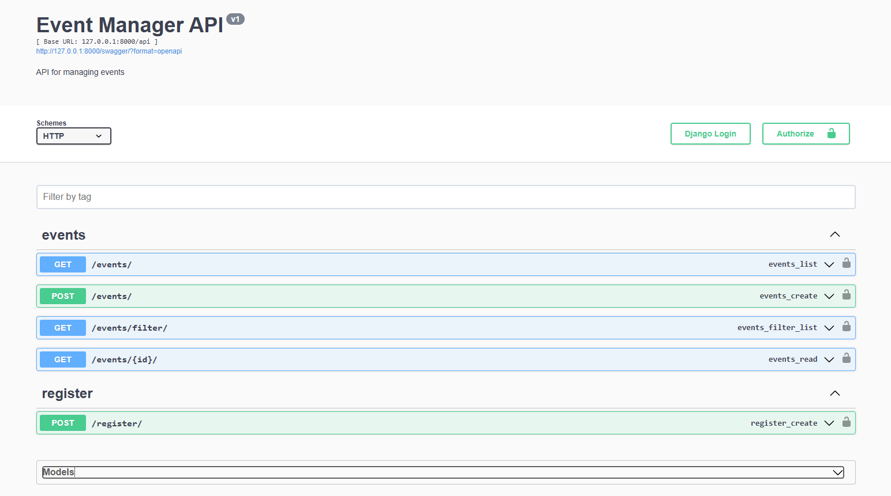

# API de Gestión de Eventos

Esta aplicación es una API RESTful desarrollada con **Django** y **Django REST Framework** para gestionar eventos. 
Permite realizar operaciones como : listar, filtrar, detallar e inscribirse a eventos.

---

## **Características**

- **Listar eventos:** Obtén una lista de todos los eventos registrados.
- **Detalle de evento:** Consulta información detallada de un evento específico.
- **Filtrar eventos:** Filtra los eventos por categoría, título o fecha.
- **Inscripción a eventos:** Permite a los usuarios inscribirse en eventos.

---

## **Requisitos Previos**

Antes de ejecutar la aplicación, asegúrate de tener los siguientes elementos instalados:

- Python 3.7 o superior
- PostgreSQL (configurado y en ejecución)
- pip

---

## **Configuración del Entorno Local**

### **1. Clonar el repositorio**

```bash
https://github.com/arimohy/event_manager.git
cd event_manager
```

### **2. Crear y activar un entorno virtual**

```bash
#usando git bash
python -m venv env
source env/Scripts/activate
#si usa powershell
.\env\Scripts\Activate.ps1
```

### **3. Instalar las dependencias**

```bash
pip install -r requirements.txt
```

### **4. Configurar la base de datos**

1. Abre el archivo `settings.py` y configura la conexión a PostgreSQL:

```python
DATABASES = {
    'default': {
        'ENGINE': 'django.db.backends.postgresql',
        'NAME': 'nombre_db',
        'USER': 'usuario',
        'PASSWORD': 'contraseña',
        'HOST': 'localhost',
        'PORT': '5432',
    }
}
```

2. Aplica las migraciones:

```bash
python manage.py migrate
```


### **5. Ejecutar el servidor local**

```bash
python manage.py runserver
```

### **6. Ejecutar tests*

```bash
python manage.py test
```

La aplicación estará disponible en `http://127.0.0.1:8000/`.

---

## **Endpoints Disponibles**

### **1. Listar Eventos**
- **Endpoint:** `/api/events/`
- **Método:** GET
- **Descripción:** Devuelve una lista de todos los eventos.

### **2. Detalle de Evento**
- **Endpoint:** `/api/events/<id>/`
- **Método:** GET
- **Descripción:** Devuelve los detalles de un evento específico.

### **3. Filtrar Eventos**
- **Endpoint:** `/api/events/?<search>=<query>`
- **Método:** GET
- **Descripción:** Filtra los eventos por categoría, título o fecha.
  - Ejemplo: `/api/events/?category=conferencia`

### **4. Inscripción a Eventos**
- **Endpoint:** `/api/register/`
- **Método:** POST
- **Descripción:** Permite registrar a un usuario en un evento.


---

## **Documentación de la API**

La documentación está disponible en formato Swagger.

- **URL:** `http://127.0.0.1:8000/swagger/`
---

## **Tecnologías Utilizadas**

- Django
- Django REST Framework
- PostgreSQL

---

## **Autor**

Yhomira Alexandra Yupayccana Lopa

---